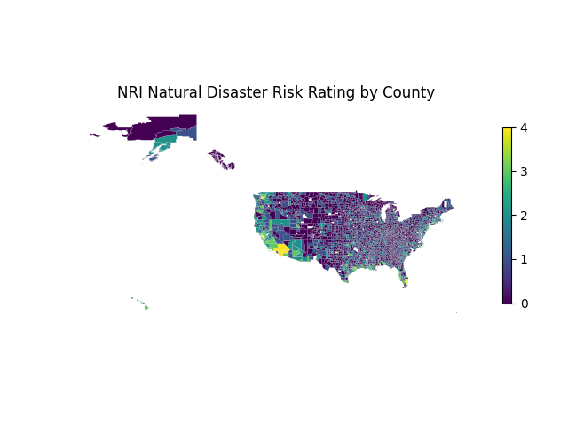
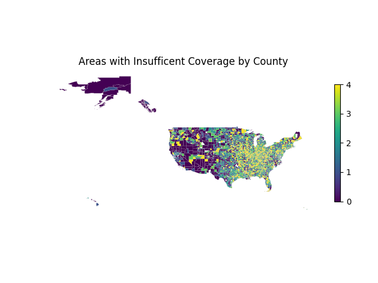
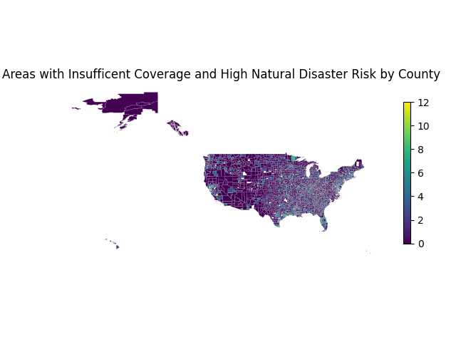

# Telecom_NatDisaster

## Data Sources

Telecom Database: https://www.kaggle.com/datasets/mattop/cellular-towers-in-the-united-states

NRI Database: https://hazards.fema.gov/nri/map

County SHP: https://www.census.gov/geographies/mapping-files/time-series/geo/carto-boundary-file.html

## Important Features

COUNTY, County name

POPULATION, Population (2020)

AREA, Area (sq mi)

TOWERCOUNT, The number of telecommunication towers in that county

RISK_RATNG, National Risk Index (i.e. Level of natural disaster risk/impact), 0 - 4

SHORTAGE_RATING, Quintile rating of the shortage of telecommunication towers based on area coverage and population, 0 - 4

BUILDTOWER, Product of RISK_RATING and SHORTAGE_RATING, indicating areas that are high in natural disaster risk and low in cell tower coverage

## Outputs

### Top 10 Counties in Need of More Telecommunication Towers
| INDEX |      BUILDTOWER |     COUNTY |  SHORTAGE_RATING | RISK_RATNG|
|------|--------|------|-----|-----|
|433     |    12.0 | WASHINGTON       |         4       |  3.0|
|527    |     12.0 |      CLARK       |         4        | 3.0|
|289   |      12.0  |    MARION       |         4        | 3.0|
|865  |       12.0 |    DOUGLAS       |         4        | 3.0|
|792       |  12.0  |    ORANGE       |         4        | 3.0|
|607      |   12.0  | LAFAYETTE           |     4        | 3.0|
|1248    |    12.0  |     WAYNE          |      4        | 3.0|
|787       |  12.0  |    ORANGE         |       3        | 4.0|
|2096     |   12.0  | ST. LOUIS        |        4       |  3.0|
|179     |    12.0    | JACKSON       |         4         |3.0|

### NRI Natural Disaster Risk Rating by County

### Areas with Insufficent Coverage by County

### Areas with Insufficent Coverage and High Natural Disaster Risk by County
